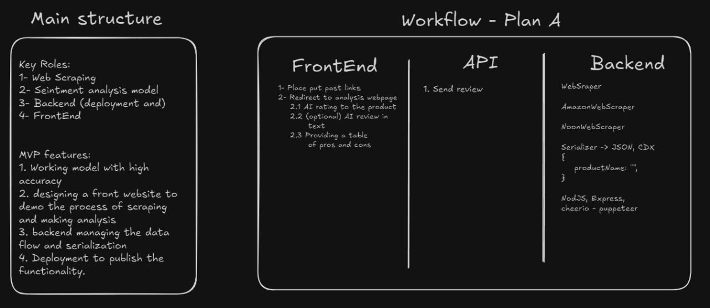

# [Real-Time Customer Reviews Analysis]

Analyzes customer product reviews (scraped in real-time) using Aspect-Based Sentiment Analysis (ABSA) to extract and summarize product pros and cons based on specific features.

## Workflow Overview

The system involves real-time scraping, ML analysis, and a web interface for interaction.

