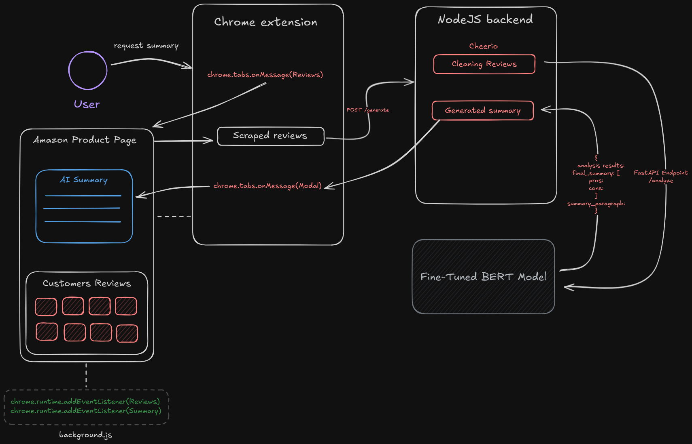

# Real-Time Customer Reviews Analysis

Analyzes customer product reviews (scraped in real-time) using Aspect-Based Sentiment Analysis (ABSA) to extract and summarize product pros and cons based on specific features.

# Table of Content
1. [Architucture](#architecture)
2. [Technology and Frameworks](#technology-and-frameworks)
3. [Aspect-Based Sentiment Analysis (ABSA)](#aspect-based-sentiment-analysis-absa)
4. [Contribution](#contribution)
5. [Future Consideration](#future-considerations)

## Architecture
This project is aimed to provide a microservice to summarize the reviews of the customers for a specific product to extract some aspects that reflect their overall satisfaction about the product, representing it back to the user in a user-friendly small paragraph form. Currently it only designed for Amazon market and we are aiming to expand this project beyond this scope, check the [future considerations](#future-considerations) for more information.

For achieving this, we have implemented a 3-tiered application consisting of:
* Chrome Extension popup
* NodeJS Backend
* Fine-tuned BERT model cluster

These three tiers are stand-alone tiers communicating according to the following architecture.

<div align="center">
    
</div>

The `background.js` injects runtime messages for later trigger using the extension when loading an Amazon product page. When a user requests a summary, extension triggers `chrome.tabs.onMessage` api to request the reviews innerHTML. The reviews is sent to the backend, cleaned and proceed by the fine-tuned BERT model for sentiment analysis. The model respond back to the backend with the followng json format
```json
{
    analysis results: [
        {
            review_text:
            aspects_extracted
        },
        ...
    ]
    final_summary:{
        pros: [
            ...
        ]
        cons:[
            ...
        ]
    }
    summary_paragraph: ...
}
```
The `summary_paragraph` is sent back to the front-end which triggers `chrome.runtime.onMessage(Modal)`, passing the paragraph to the content-scripts for injecting a modal in the webpage consisting the summary.

Here is a demo of the results


## Aspect-Based Sentiment Analysis (ABSA)
The documentation for the work and outputs of the model is documented [Here](/services/ml-1/)

## Technology and Frameworks

### Frontend
* Vue.js
* Chrome Apis

### Backend
* NodeJS/Express
* Cheerio
* Vercel Deployment

### Machine Learning
* PyTorch
* BERT
* Hugging Face
* FastAPI

## Contribution

## Future Considerations